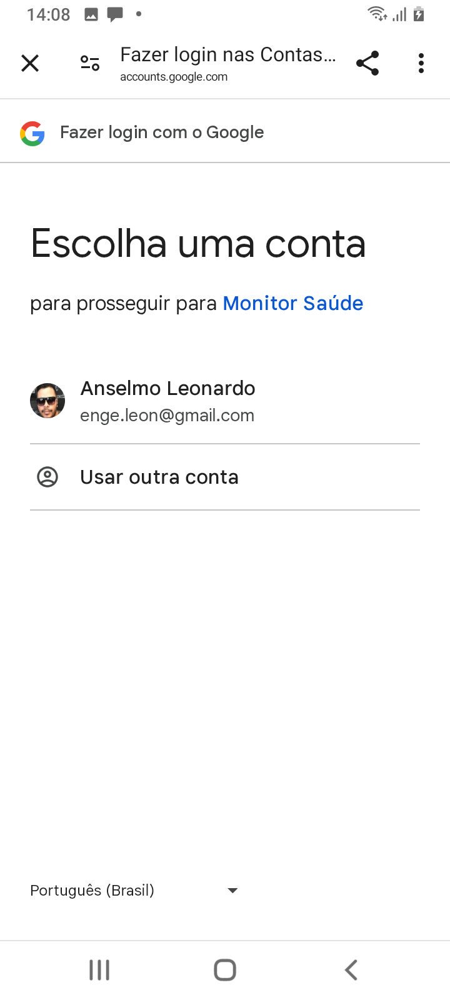
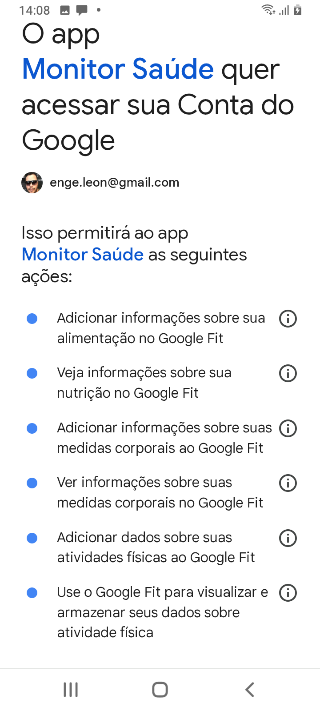
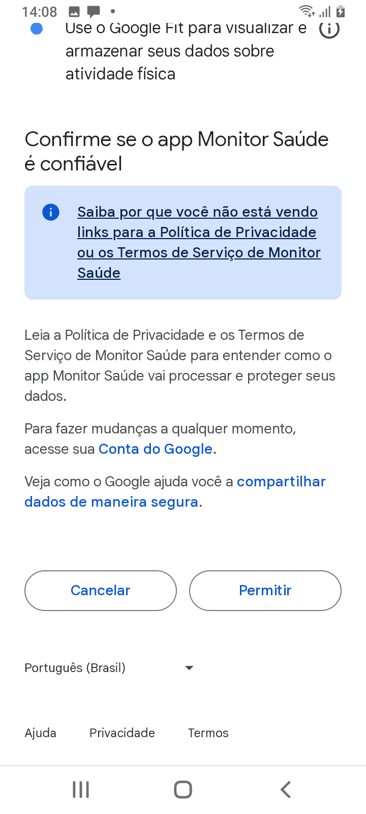
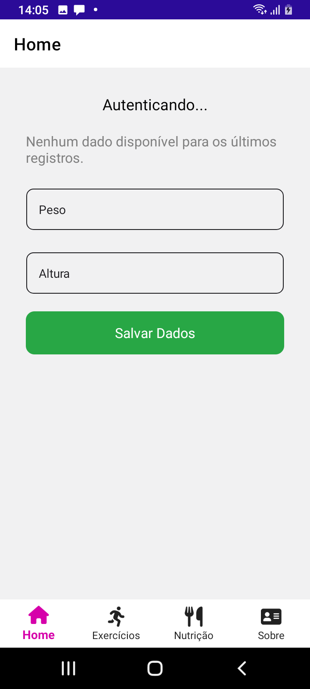
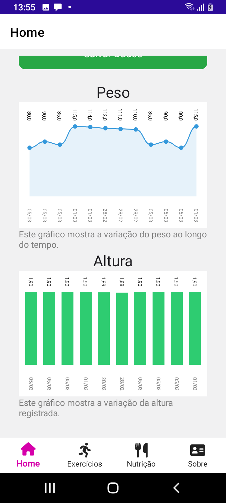
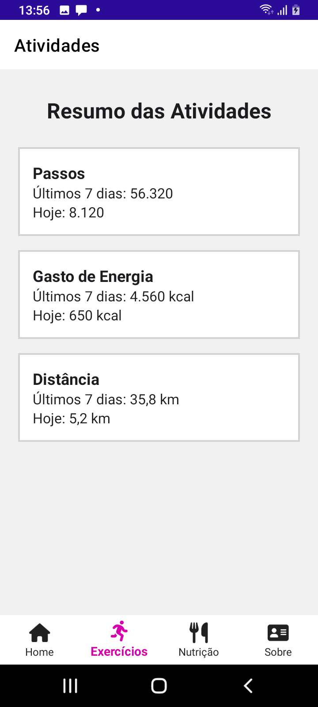
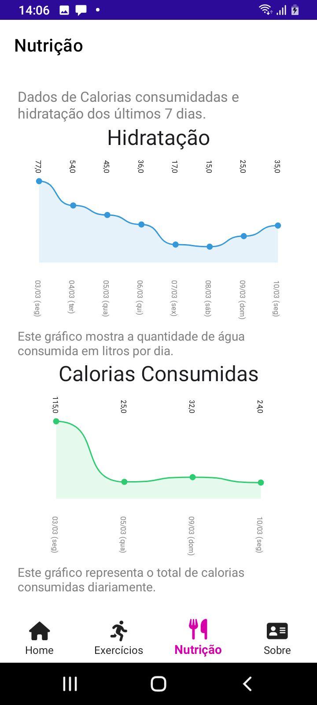
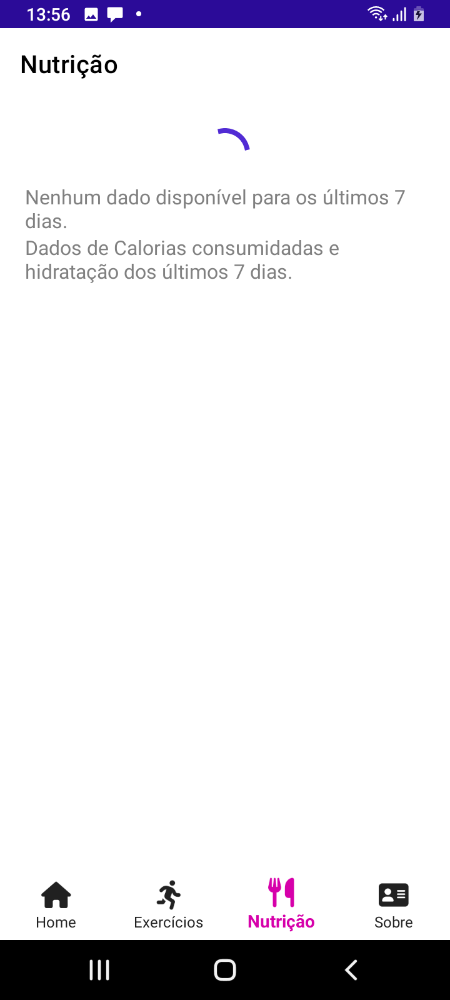

# MonitorSaude

**MonitorSaude** é um aplicativo completo para monitoramento de atividades físicas, saúde e alimentação. 
## Descrição

O MonitorSaude foi desenvolvido para oferecer uma experiência completa de monitoramento pessoal, permitindo que o usuário registre seus exercícios, acompanhe métricas de saúde em tempo real e visualize seu progresso ao longo do tempo. O aplicativo sincroniza dados com APIs de saúde, como a **Google Fit API** (para Android)  e conta com armazenamento local para acesso offline, garantindo que as informações estejam sempre disponíveis, mesmo sem conexão à internet.

## Features da Aplicação

- **Integração com APIs de Saúde**  
  - Sincronização com Google Fit (Android) para obter e enviar dados de atividades, saúde e alimentação.

- **Gráficos Complexos e Informativos**  
  - Implementação de gráficos de linha e barras para acompanhamento do progresso do usuário, facilitando a visualização das métricas ao longo do tempo.

- **Sincronização de Dados e Armazenamento Local**  
  - Sincronização de dados entre dispositivos e com a API de saúde.
  - Armazenamento local para acesso offline, garantindo a disponibilidade das informações mesmo sem conexão.

- **Padrão MVVM com Dependency Injection**  
  - Estrutura arquitetural moderna utilizando o padrão MVVM, promovendo separação de responsabilidades e facilitando a manutenção e a testabilidade do código.
  
- **Diferenciação Avançada de UI/UX**  
  - Customizações específicas para Android (Material Design)  para oferecer a melhor experiência.

- **Otimização de Performance**  
  - Uso de threading e tarefas assíncronas para garantir que o aplicativo seja responsivo e eficiente, independentemente da plataforma.
 
## Screenshots

**Tela de login do Google OAuth2.0**

**Tela de Permissões do Google Fitness API**

**Tela de Permissões do Google Fitness API**

**Tela de home da aplicação com as entradas de peso e altura para o usuário**

**Tela de home da aplicação com os gráficos de peso e altura**

**Tela de Atividades**

**Tela com os dados hidratação e calorias do usuario**

**Tela de Nutrição com loading enquanto os dados são requistados na API**

## Tecnologias Utilizadas

- **.NET MAUI**  
  - Desenvolvimento multiplataforma para Android, iOS e outras plataformas.
- **C#**  
  - Linguagem de programação utilizada para a implementação do aplicativo.
- **Google Fit API 
  - Integração com APIs de saúde para sincronização e monitoramento de dados.
- **MVVM**  
  - Padrão de arquitetura para separação de responsabilidades.
- **Dependency Injection**  
  - Gerenciamento de dependências para maior modularidade e testabilidade.
- **SQLite**  
  - Armazenamento local para acesso offline dos dados.

## Considerações Finais

Este projeto foi desenvolvido para demonstrar habilidades avançadas em resolução de problemas complexos, implementação de padrões de projeto, customizações nativas e otimização de performance. Ele serve como prova de conceito e evidência das capacidades necessárias para atuar como Analista de Sistemas Desenvolvedor Mobile Sênior.

---

Sinta-se à vontade para explorar o código, abrir issues e contribuir com sugestões.  
